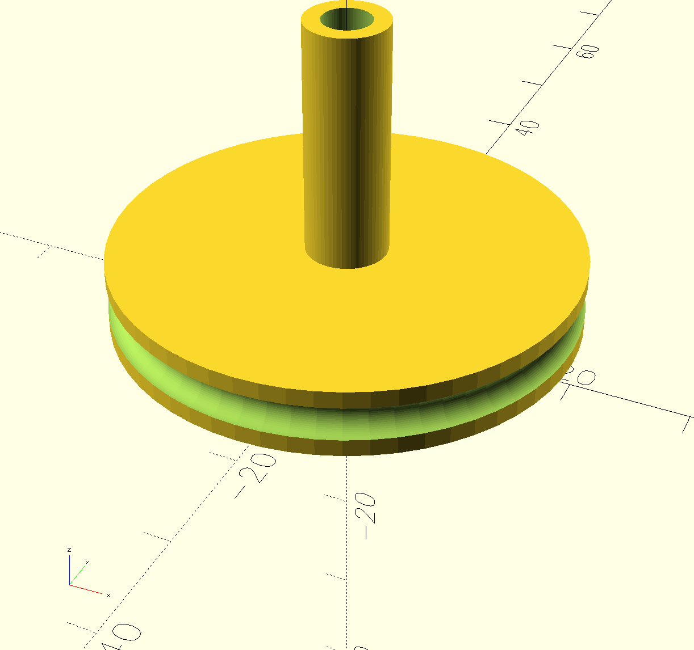
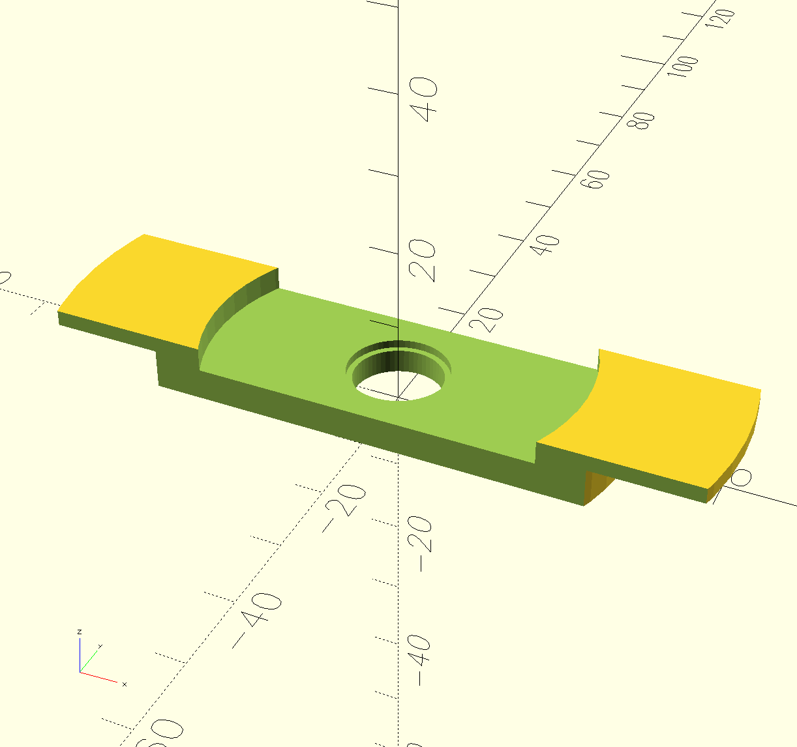
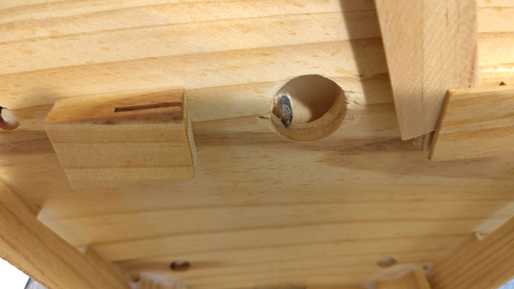
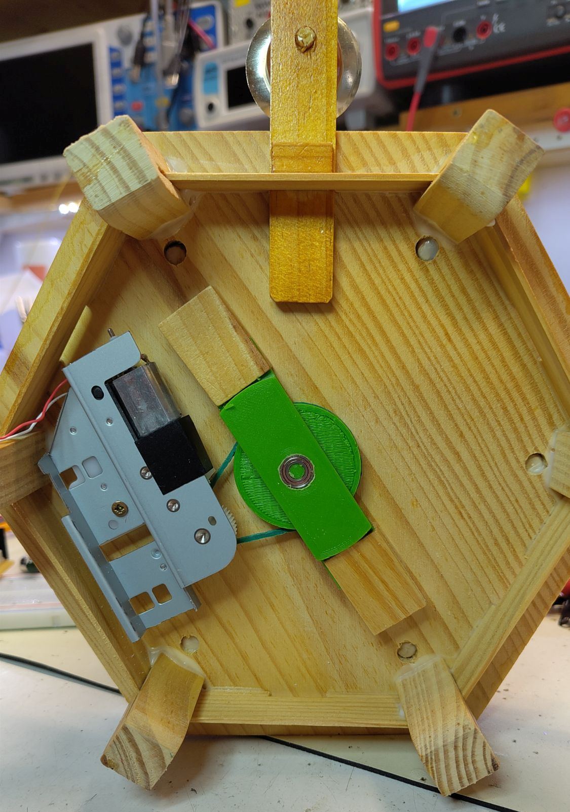
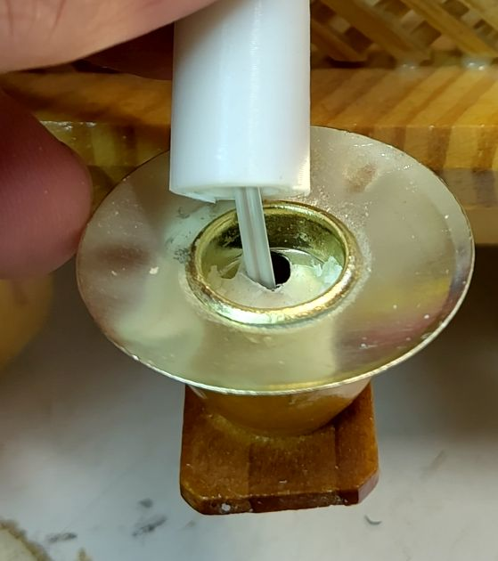
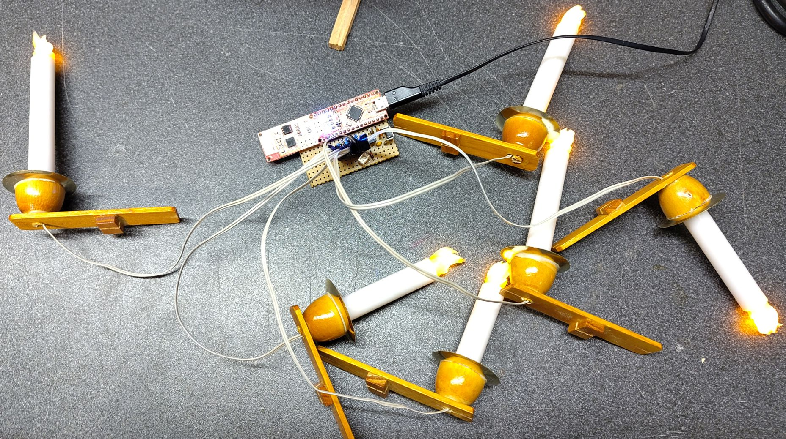
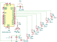
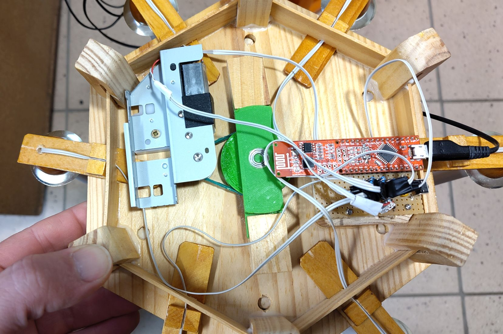

# Antrieb und Kerzen für Weihnachtspyramide

[Weihnachtspyramide](Bilder/Pyramide.jpg)

Und als kurzes Video: [Weihnachtspyramide](Bilder/Pyramide.mp4)

## Kurzfassung

Ein Arduino Nano ESP steuert den Antrieb und die LED Kerzen einer Weihnachtspyramide.

Über den ESP wird eine MQTT Anbindung erstellt.

## Hintergrund

Unsere Weihnachtspyramide ist seit einigen Jahren nicht mehr genutzt worden, da niemand Lust hat auf die echten Kerzen aufzupassen. Außerdem läuft sie mit den Kerzen nicht so gut.

In der Bastelkiste hatte ich noch einen (uralten) [Arduino Nano ESP](https://iot.fkainka.de/board) von F. Kainka und aus dem alten Drucker den Antrieb für die Scan Einheit.

## Aufbau

Passt es für eure Weihnachtspyramide an, dieser Abschnitt bezieht sich auf meine Pyramide.

### Antrieb 

Mit einem Motor aus der Bastelkiste probiert. Alter Antriebsmotor aus Scanner mit Getriebe. Blech zurecht gesägt. Optische Drehzahlerfassung entfernt. Anstelle Zahnräder, einen Gummiring verwendet. Letztes Zahnrad am Motor geschliffen so dass eine Laufrille für den Gummiring entsteht.  

Adapter von Antriebsstange über Antriebsrad bis Aufnahme in Kugellager, [Antrieb](Druckvorlagen/Antrieb.scad), und eine Kugellager Halterung,[Grundplatte](Druckvorlagen/Grundplatte.scad),  in OpenScad gezeichnet. Druck in PETG. Material ist guter Kompromiss zwischen leicht auf dem alten Creatity Ender druckbar und ausreichender Festigkeit. 

Antrieb                    |  Grundplatte
:-------------------------:|:-------------------------:
 | 

Der neue Antrieb ersetzt die alte Lagerung in einer Keramikschale.

Vorher                    |  Nachher
:-------------------------:|:-------------------------:
 | 

### Ansteuerung des Motors
  
Der Motor läuft ab 2,5 V an. Bilde 0 bis 100 auf 0 + [128, 255] ab. Er nimmt maximal 80 mA auf. Es reicht ein kleiner Transistor zum Schalten.

Aus Bastelkiste BC 639, 1 A maximal, gemessen Verstärkung hFE 100, Datenblatt mindestens 25 bei 5 mA Basisstrom. Auslegung, 560 Ohm Vorwiderstand

### Kerzen

Auf Thingiverse habe ich Kerzen mit schön gestalteten Flammen gefunden. Sie sind Teil eines Weihnachtsbogens [Christmas Light Bow](https://www.thingiverse.com/thing:4674237) von M. Lachmann. Flamme.stl mit transparentem PLA und die Kerzen in weißem PLA gedruckt. 

Kerze.stl hat Original 10 mm Durchmesser. Ich benötige 13 mm. Skaliere in x und y Richtung um 130 %. In x Richtung Skalierung 70, 80, 90, 100, 110, 120 %. Sieht nach ungleichmäßig abgebrannten Kerzen aus.

Löcher in die original Kerzenhalter gebohrt und Kabel durchgeführt:

Kabelführung                    |  Fertige Kerzen
:-------------------------:|:-------------------------:
 | 

An der Pyramide habe ich die Aussparungen für die Kerzenhalter mit einer Feile um deine Kabeldurchführung vergrößert.

Helle orange LEDs mit 5 mm Druchmesser im Vorrat entdeckt. Mit denen ergibt sich ein warmes Kerzenlicht. Jede LED mit zweiadrigem Kabel (Altes Flachbahn Kabel von Floppy) und 2,5 mm Stecker anbinden.

Vermessen 2,07 V bei 20 mA. Gewählt, 150 Ohm Vorwidderstand bei 5 V Versorgung und 0,5 V Spannungsabfall im ATMEGA.

## Schaltplan und Platine

Die Schaltung ist recht einfach. Motor und LEDs werden mit 5 V aus dem Arduino betrieben.

Aufgebaut habe ich es auf einem Stück Lochraster Platine

Der USB Anschluss und der Taster zur Bedienung ragen etwas unter dem Holzrahmen der Pyramide hervor. Mit dem Taster lassen sich die Kerzen und der Motor ein- und ausschalten.

## Arduino Sketch

Im Code erklärt: [PyramidenMqtt](PyramidenMqtt/PyramidenMqtt.ino)

Die NanoESP Boards sind schon sehr betagt, aber es funktioniert immer noch. Ich habe zwei Anpassungen an der NanoESP Bibliothek vorgenommen: Messages zuschneiden und obsolete subscribe events bei disconnect löschen. Getestet habe ich mit meinem Fork der [NanoESP Bibliothek](https://github.com/MathiasMoog/NanoESP)

Damit 6 LEDs und der Motor per PWM angesteuert werden können, nutze ich für die LEDs die [SoftPWM Bibliothek](https://github.com/bhagman/SoftPWM) von B. Hagman.

Die Konfiguration erfolgt in secrets.h. Eingecheckt ist nur die secretsVorlage.h. In secrets.h umbenennen und anpassen.

## Einbindung in die Hausautomation

Ich nutze [openHAB](https://www.openhab.org/) mit einer textuellen Konfiguration.

Hier die Thing Definition

    Thing mqtt:topic:weihnachtspyramide "Weihnachtspyramide" (mqtt:broker:myBroker) {
      Channels:
      // Motor als Dimmer, 0..100
      Type dimmer : motor "Motor" [ stateTopic="openhab/pyramide/motor/state", commandTopic="openhab/pyramide/motor/set", min=0, max=100, step=1 ]
      // Kerzen als Switch, ON / OFF
      Type switch : kerzen "Kerzen" [ stateTopic="openhab/pyramide/kerzen/state", commandTopic="openhab/pyramide/kerzen/set" ]
    } 
	
Diese gehört in eine Bridge hinein die die Verbindung zu dem MQTT broker beinhaltet.

Die Items zu den beiden channels:

    Group gMqttWeihnachtspyramide "Weihnachtspyramide" <network> (gEG_Buero)

    /* Motor der Weihnachtspyramide.
        Dimmer 0..100
        0 = Aus
        1 = Anlauf, ca. 2.5 V
        100 = Voll an
    */    
    Dimmer PyramideMotor "Motor [%d]" <network> (gMqttWeihnachtspyramide) 
      { channel="mqtt:topic:weihnachtspyramide:motor" }

    /* Kerzen der Weihnachtspyramide.
        Switch Ein/Aus, flackern sobald ein.
    */
    Switch PyramideKerzen "Kerzen" <network> (gMqttWeihnachtspyramide) 
      { channel="mqtt:topic:weihnachtspyramide:kerzen" }

So lässt sich alles vom Handy aus bedienen und die LEDs gehen mit der restlichen Weihnachtsbeleuchtung automatisch an.

## Testen

Zum Testen - und für den Betrieb - wird ein MQTT broker benötigt. Ich verwende den [Mosquitto broker](https://mosquitto.org/) von Eclipse.

Es hat etwas gedauert bis ich eine stabile Lösung mit automatischen Neu-Verbindungen zum WiFi und MQTT beisammen hatte. Ein Blick in die Mosquitto Logs hilft ...

    sudo tail -f /var/log/mosquitto/mosquitto.log

Mittlerweile gehen nur noch sehr selten (während reconnect) MQTT messages verloren, ggf. Prüfen

    mosquitto_sub -h xxx -u xxx -P xxx -t openhab/pyramide/#

## Nachbau

Den NanoESP gibt es schon länger nicht mehr. Der Arduino Nano ESP 32 ist nahezu Pin-Kompatibel. Zu beachten ist:

- Er arbeitet mit 3.3 V, ggf. die LED Vorwiderstände anpassen 
- Mein Motor benötigt 5 V, die können von USB übernommen werden
- Die SoftPWM Bibliothek ist nicht mehr notwendig
- Es wird ein anderer MQTT Client benötigt, z.B. ArduinoMqttClient

Umgesetzt habe ich es nicht, hier ein MQTT Beispiel mit dem Nano ESP 32: [MQTT LED](https://gitlab.com/MathiasMoog/L20_MqttLed)

Ansonsten irgendein günstiges ESP 32 Board ...

